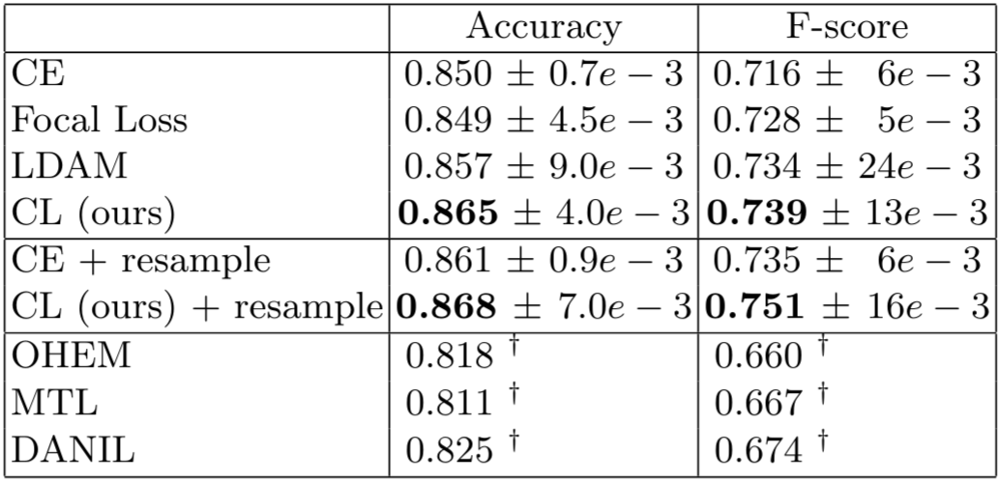

# CICL
Code accompanying the paper "Fighting Class Imbalance with Contrastive Learning" (MICCAI2021)\
https://lmb.informatik.uni-freiburg.de/Publications/2021/MMB21/
\
Yassine Marrakchi, Osama Makansi, Thomas Brox.

<p align="center">
  
</p>


The algorithm is based on supervised contrastive loss. It is able to efficiently learn good features for imbalanced image classification.
The code supports the classification for automated diagnosis of pigmented skin lesions using the HAM10000 dataset. 

## Running
 
Pretraining stage:
```
python main_supcon.py --batch_size 1024 \
  --learning_rate 0.5 \
  --temp 0.1 \
  --cosine
```

Linear evaluation stage:
```
python main_linear.py --batch_size 512 \
  --learning_rate 5 \
  --ckpt /path/to/model.pth
```


## Comparison
Results on HAM-10000 (also used in ISIC-2018 lesion diagnosis challenge):
<p align="center">
  
</p>


## Reference
```
@inproceedings{DBLP:conf/miccai/MarrakchiMB21,
  author    = {Yassine Marrakchi and
               Osama Makansi and
               Thomas Brox},
  title     = {Fighting Class Imbalance with Contrastive Learning},
  booktitle = {Medical Image Computing and Computer Assisted Intervention - MICCAI},
  year      = {2021},
  doi       = {10.1007/978-3-030-87199-4\_44},
}
```
